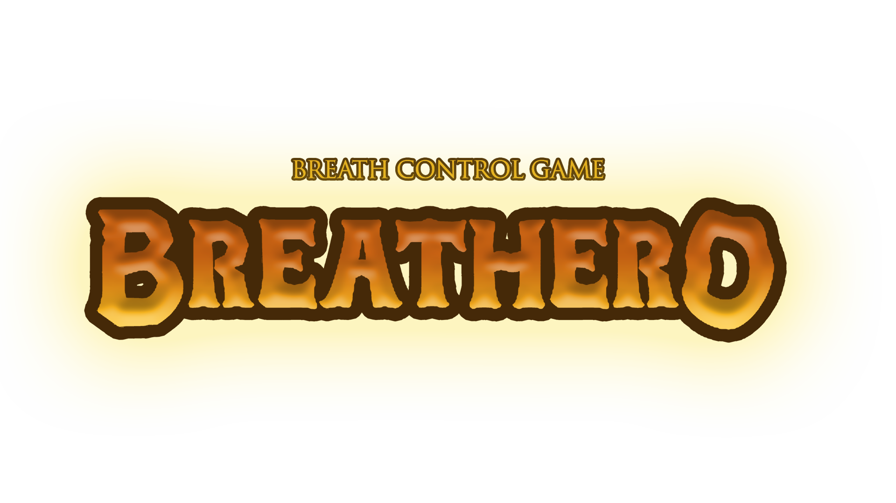
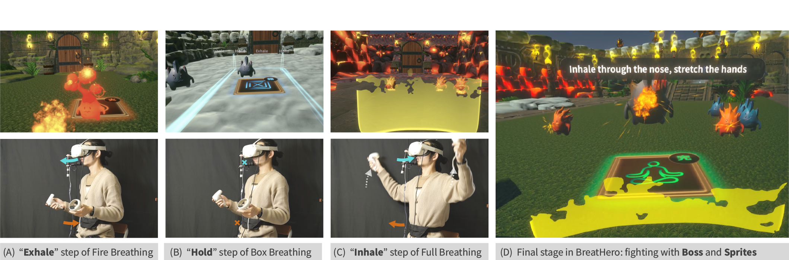
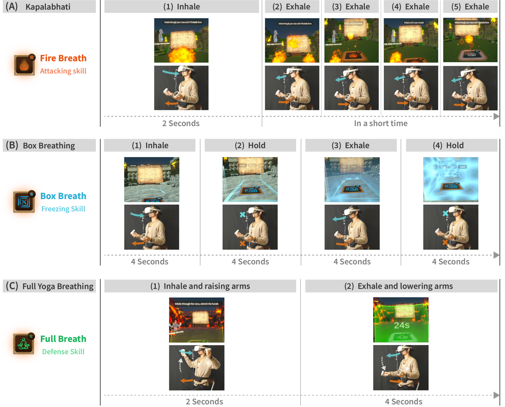
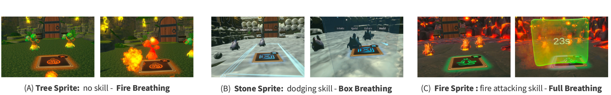
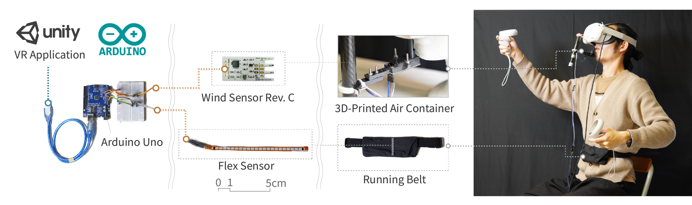

<!-- Improved compatibility of back to top link: See: https://github.com/othneildrew/Best-README-Template/pull/73 -->

<!--
*** Thanks for checking out the Best-README-Template. If you have a suggestion
*** that would make this better, please fork the repo and create a pull request
*** or simply open an issue with the tag "enhancement".
*** Don't forget to give the project a star!
*** Thanks again! Now go create something AMAZING! :D
-->

<!-- PROJECT SHIELDS -->
<!--
*** I'm using markdown "reference style" links for readability.
*** Reference links are enclosed in brackets [ ] instead of parentheses ( ).
*** See the bottom of this document for the declaration of the reference variables
*** for contributors-url, forks-url, etc. This is an optional, concise syntax you may use.
*** https://www.markdownguide.org/basic-syntax/#reference-style-links
-->

<!-- PROJECT LOGO -->
 

  

<h3 align="center">Breathero: Not Another Slow Breathing Game — Exploring Faster-Paced VR Breathing Exercise Games</h3>

  

     
    <a href="https://dl.acm.org/doi/10.1145/3544549.3583829"><strong> Read the Paper » ACM CHI'23 Paper</strong></a>
     
    (Overall Acceptance Rate 6,164 of 23,696 submissions, 26%)
     
     
    <strong> View Demo Video</strong>
     
    <a href="https://www.youtube.com/watch?v=UhD6bkmndzs"><strong>100s Preview</strong></a>
    &middot;
    <a href="https://drive.google.com/file/d/1M8j_VoiyHWlJC4xIYete_q8bSjsO-3qn/view?usp=sharing"><strong>4min Gameplay Video</strong></a>
<!--     &middot;
    <a href="https://github.com/github_username/repo_name/issues/new?labels=enhancement&template=feature-request---.md">Request Feature</a> -->
  

<!-- EMS PHOTO -->

  
 

<!-- ABOUT THE PROJECT -->
## About The Paper

BreatHero is a faster-paced Virtual Reality (VR) action game that explores the potential of combining breathing techniques learning with the combat elements of action games. BreatHero uses breathing techniques as various skills for attacking and defending against the enemies, so players can do breathing exercises while enjoying defeating the in-game enemies. We choose three breathing techniques: Kapalabhati, Box Breathing, and Full Yogic Breathing, which are all beneficial for physical and mental health. To enhance breathing techniques learning and memorization in action games, we present two design concepts: Imitative Breathing Feedback and Associate Learning on Breathing Techniques. Results from our study indicated that players found the game to be more engaging and were willing to play it repeatedly, suggesting that breathing exercises can be effectively integrated into faster-paced action games.

### Built With

* [![Unity][unity-shield]][unity-url]
* [![Arduino][arduino]][arduino-url]
* ![C#][C#-s]
* 
* [![HTC][HTC-s]][HTC-url]
 

<!-- GETTING STARTED -->
## Game Concept And Desigh

<!-- EMS PHOTO -->
 

  
 

In BreatHero, we have included three different breathing techniques,
known as 1) "Kapalabhati", which involves inhaling one time
and exhaling four times in rapid succession while contracting the
abdomen during exhalation. 2) "Box Breathing", which involves
four steps: breathing in, holding the breath, breathing out, and
holding the breath again, with each step lasting for four seconds.
and 3) "Full Yogic Breathing", which involves inhalation while
raising the arms and exhalation while lowering the arms. These
three techniques correspond to three different skills in the game.

<!-- USER EQUIP PHOTO -->

  
 

 

<!-- GETTING STARTED -->
## Hardware Sensor
<!-- STUDY RESULT PHOTO -->
 

  
 

To accurately detect the player’s breathing and instruct the player
to breathe, we installed a sensor on the VR headset that can measure
the wind speed, called the "Wind Sensor Rev. C.". However,
we cannot determine whether the player is inhaling or exhaling
only based on wind speed. To address this, we also attach a Flex
Sensor to the player’s abdomen. As the player performs diaphrag-
matic breathing, the sensor will change its resistance value as the
abdomen is inflated or deflated, allowing us to detect whether the
player is inhaling or exhaling. By combining these two sensors, we can
determine the player’s breathing pattern, including inhaling, exhal-
ing, or holding their breath, as well as the duration of the breath.
Finally, we will connect these two sensors to the computer through
an Arduino Uno board, as shown in the figure above.

<!-- MARKDOWN LINKS & IMAGES -->
<!-- https://www.markdownguide.org/basic-syntax/#reference-style-links -->
[unity-shield]:https://img.shields.io/badge/unity-%23000000.svg?style=for-the-badge&logo=unity&logoColor=white
[unity-url]:https://unity.com/
[arduino]:https://img.shields.io/badge/-Arduino-00979D?style=for-the-badge&logo=Arduino&logoColor=white
[arduino-url]:https://www.arduino.cc/
[C#-s]:https://img.shields.io/badge/c%23-%23239120.svg?style=for-the-badge&logo=csharp&logoColor=white
[HTC-s]:https://img.shields.io/badge/HTC%20VIVE-black?style=for-the-badge&logo=htcvive
[HTC-url]:https://www.vive.com/
[contributors-shield]: https://img.shields.io/github/contributors/github_username/repo_name.svg?style=for-the-badge
[contributors-url]: https://github.com/github_username/repo_name/graphs/contributors
[forks-shield]: https://img.shields.io/github/forks/github_username/repo_name.svg?style=for-the-badge
[forks-url]: https://github.com/github_username/repo_name/network/members
[stars-shield]: https://img.shields.io/github/stars/github_username/repo_name.svg?style=for-the-badge
[stars-url]: https://github.com/github_username/repo_name/stargazers
[issues-shield]: https://img.shields.io/github/issues/github_username/repo_name.svg?style=for-the-badge
[issues-url]: https://github.com/github_username/repo_name/issues
[license-shield]: https://img.shields.io/github/license/github_username/repo_name.svg?style=for-the-badge
[license-url]: https://github.com/github_username/repo_name/blob/master/LICENSE.txt
[linkedin-shield]: https://img.shields.io/badge/-LinkedIn-black.svg?style=for-the-badge&logo=linkedin&colorB=555
[linkedin-url]: https://linkedin.com/in/linkedin_username
[product-screenshot]: images/screenshot.png
[Next.js]: https://img.shields.io/badge/next.js-000000?style=for-the-badge&logo=nextdotjs&logoColor=white
[Next-url]: https://nextjs.org/
[React.js]: https://img.shields.io/badge/React-20232A?style=for-the-badge&logo=react&logoColor=61DAFB
[React-url]: https://reactjs.org/
[Vue.js]: https://img.shields.io/badge/Vue.js-35495E?style=for-the-badge&logo=vuedotjs&logoColor=4FC08D
[Vue-url]: https://vuejs.org/
[Angular.io]: https://img.shields.io/badge/Angular-DD0031?style=for-the-badge&logo=angular&logoColor=white
[Angular-url]: https://angular.io/
[Svelte.dev]: https://img.shields.io/badge/Svelte-4A4A55?style=for-the-badge&logo=svelte&logoColor=FF3E00
[Svelte-url]: https://svelte.dev/
[Laravel.com]: https://img.shields.io/badge/Laravel-FF2D20?style=for-the-badge&logo=laravel&logoColor=white
[Laravel-url]: https://laravel.com
[Bootstrap.com]: https://img.shields.io/badge/Bootstrap-563D7C?style=for-the-badge&logo=bootstrap&logoColor=white
[Bootstrap-url]: https://getbootstrap.com
[JQuery.com]: https://img.shields.io/badge/jQuery-0769AD?style=for-the-badge&logo=jquery&logoColor=white
[JQuery-url]: https://jquery.com 
